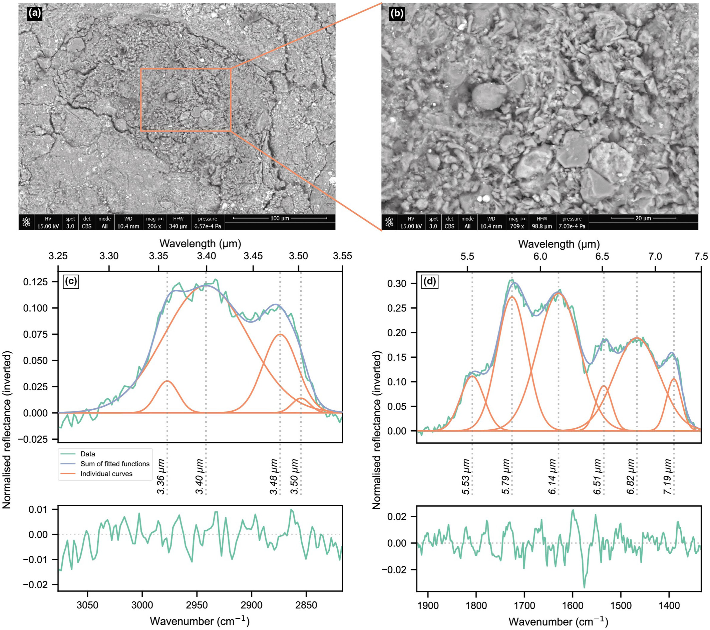

# Publications

## 2024

    

        
    

    

        <h3 class="publication-title">
            <a href="/AgentBreeder" class="publication-link">
                Extent of alteration, paleomagnetic history, and infrared spectral properties of the Tarda ungrouped carbonaceous chondrite
            </a>
        </h3>
        
Meteoritics & Planetary Science

        
H. C. Bates, R. Aspin, C. Y. Fu, C. S. Harrison, E. Feaver, E. Branagan-Harris, A. J. King, J. F. J. Bryson, S. Sridhar, and C. I. O. Nichols

        
2024

        

            Meteorite
            <a href="https://doi.org/10.1111/maps.14224" class="tag tag-arxiv">DOI</a>
        

    

    

        
    

    

        <h3 class="publication-title">
            <a href="https://openreview.net/pdf?id=5HGu0ZqBl9" class="publication-link">
                Stream: Scaling Mechanistic Interpretability to Long Context in LLMs via Sparse Attention
            </a>
        </h3>
        
NeurIPS 2025 Mech Interp Workshop

        
J Rosser, José Luis Redondo García, Gustavo Penha, Konstantina Palla, Hugues Bouchard

        
2025

        

            Mechanistic Interpretability
            <a href="https://openreview.net/pdf?id=5HGu0ZqBl9" class="tag tag-arxiv">ARXIV</a>
        

    

    

        
    

    

        <h3 class="publication-title">
            <a href="https://openreview.net/pdf?id=NJNr5KbW3m" class="publication-link">
                Mapping Faithful Reasoning in Language Models
            </a>
        </h3>
        
NeurIPS 2025 Mech Interp Workshop

        
Jiazheng Li, Andreas Damianou, J Rosser, José Luis Redondo García, Konstantina Palla

        
2025

        

            Mechanistic Interpretability
            <a href="https://openreview.net/pdf?id=NJNr5KbW3m" class="tag tag-arxiv">ARXIV</a>
        

    

