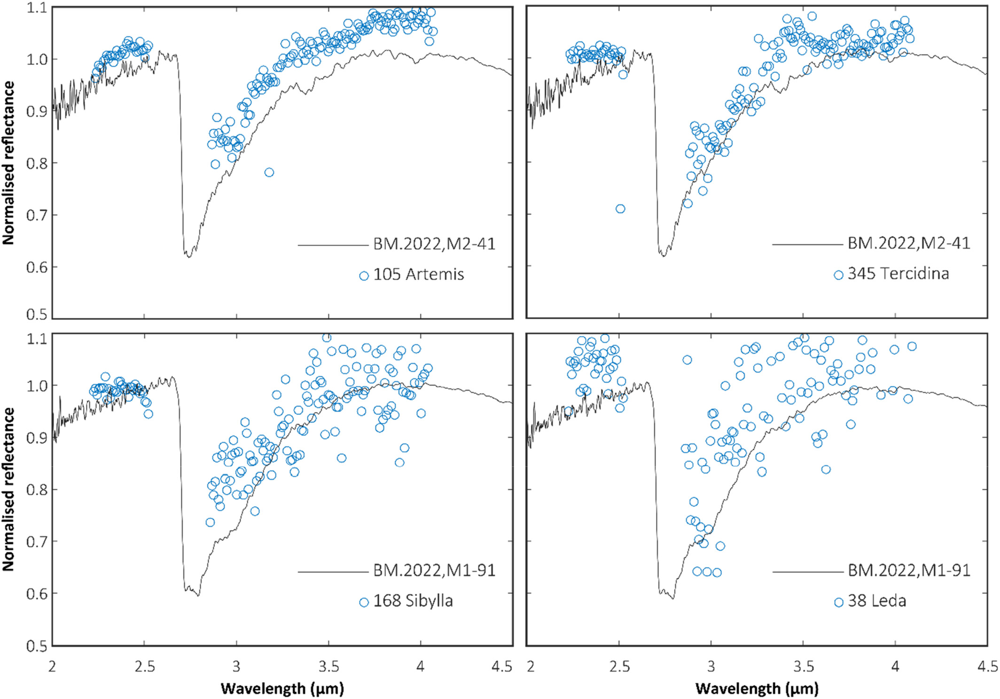
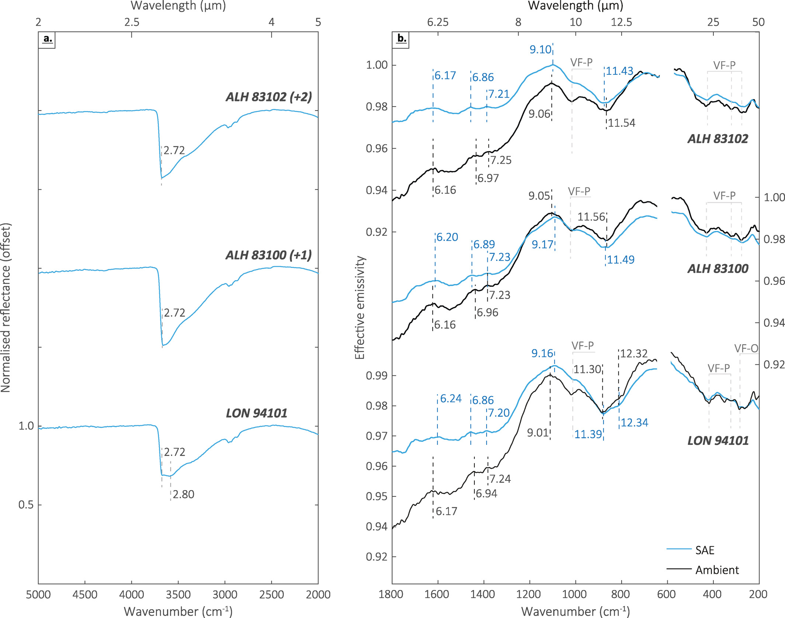

# Publications

  

    

      <h3>2024</h3>
      <ul>
        <li>Publication A...</li>
      </ul>
    

    

      <h3>2023</h3>
      <ul>
        <li>Publication B...</li>
      </ul>
    

    

      <h3>2022</h3>
      <ul>
        <li>Publication C...</li>
      </ul>
    

  

  

  

  

## 2024

    

        
    

    

        <h3 class="publication-title">
            <a href="https://onlinelibrary.wiley.com/doi/10.1111/maps.14224" class="publication-link">
                Extent of alteration, paleomagnetic history, and infrared spectral properties of the Tarda ungrouped carbonaceous chondrite
            </a>
        </h3>
        
Meteoritics & Planetary Science

        
H. C. Bates, R. Aspin, C. Y. Fu, C. S. Harrison, E. Feaver, E. Branagan-Harris, A. J. King, J. F. J. Bryson, S. Sridhar, C. I. O. Nichols

        
2024

        

            Meteorite
            X-ray diffraction
            Electron microscopy
            Water content
            Magnetics
            IR Spectroscopy            
        

    

    

        
    

    

        <h3 class="publication-title">
            <a href="https://onlinelibrary.wiley.com/doi/full/10.1111/maps.14043" class="publication-link">
                The bulk mineralogy, elemental composition, and water content of the Winchcombe CM chondrite fall
            </a>
        </h3>
        
Meteoritics and Planetary Science

        
H. C. Bates, A. J. King, K. S. Shirley, E. Bonsall, C. Schröder, F. Wombacher, T. Fockenberg, R. J. Curtis, N. E. Bowles

        
2024

        

            Meteorite
            X-ray diffraction
            Element Analysis
            Water content
            Mössbauer
        

    

## 2021

    

        
    

    

        <h3 class="publication-title">
            <a href="https://agupubs.onlinelibrary.wiley.com/doi/full/10.1029/2021JE006827" class="publication-link">
                A Spectral Investigation of Aqueously and Thermally Altered CM, CM-An, and CY Chondrites Under Simulated Asteroid Conditions for Comparison With OSIRIS-REx and Hayabusa2 Observations
            </a>
        </h3>
        
Journal of Geophysical Research: Planets

        
H. C. Bates, K. L. Donaldson Hanna, A. J. King, N. E. Bowles, S. S. Russell

        
2021

        

            Meteorite
            IR Spectroscopy
        

    

